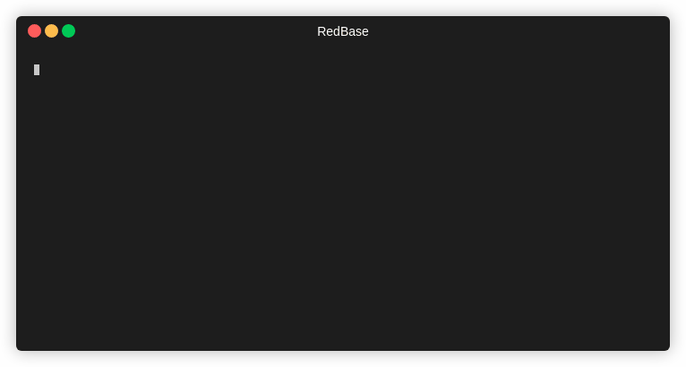
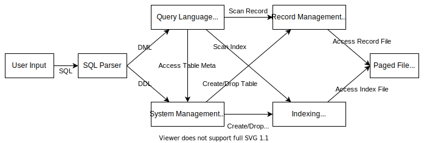

# RedBase-C++



A simple relational database based on [Stanford CS346 RedBase](https://web.stanford.edu/class/cs346/2015/redbase.html), implemented in elegant modern C++11.

## Features

+ Indexing. We implement B+Tree index to accelerate single-table queries as well as table joins.
+ Data Persistence. All changes to data are persistent on disk if the shell exits normally.
+ SQL support. We support a subset of SQL, including basic DDL (`create table`, `drop table`, `create index`, `drop index`) and DML (`insert`, `delete`, `update`, `select`) statements.

## Quick Start

Prepare a Linux / macOS machine, and clone this project to your local environment.

```sh
git clone https://github.com/li-plus/redbase-cpp && cd redbase-cpp
```

Install dependencies of this project. We use CMake as the C++ build system. Flex & Bison are used to generate the SQL parser. `libreadline` helps us to build a user-friendly shell.

```sh
sudo apt install cmake flex bison libreadline-dev
```

Then build the project and make optional unittest.

```sh
mkdir -p build/ && cd build
cmake .. -DCMAKE_BUILD_TYPE=Release
make -j
make test   # optional
```

Now start the RedBase shell and have fun!

```sh
./bin/redbase mydb
```

This command creates a database named `mydb` for the first time, since it does not exist yet. On the next time, it will directly load the existing database `mydb`. To drop the database `mydb`, simply remove this folder by `rm -r mydb`.

## Demo

Below is a quick demo of the supported main features.

```sql
create table student (id int, name char(32), major char(32));
create index student (id);
create table grade (course char(32), student_id int, score float);
create index grade (student_id);

show tables;
desc student;

insert into student values (1, 'Tom', 'Computer Science');
insert into student values (2, 'Jerry', 'Computer Science');
insert into student values (3, 'Jack', 'Electrical Engineering');

select * from student;
update student set major = 'Electrical Engineering' where id = 2;
select * from student;
delete from student where name = 'Jack';
select * from student;

insert into grade values ('Data Structure', 1, 90.0);
insert into grade values ('Data Structure', 2, 95.0);
insert into grade values ('Calculus', 2, 82.0);
insert into grade values ('Calculus', 1, 88.5);

select * from student, grade;
select id, name, major, course, score from student, grade where student.id = grade.student_id;

drop index student (id);
desc student;

drop table student;
drop table grade;
show tables;

exit;
```

## Architecture



+ **Paged File Module (PF)** enables higher-level modules to perform efficient file I/O in terms of pages.
+ **Record Management Module (RM)** manages the storage of unordered records.
+ **Indexing Module (IX)** manages persistent indexes over unordered data records stored in record files.
+ **System Management Module (SM)** handles the data definition language (DDL), including `create table`, `drop table`, `create index`, `drop index` statements.
+ **Query Language Module (QL)** handles the data manipulation language (DML), including `insert`, `delete`, `update`, `select` statements.
+ **SQL Parser** translates a raw SQL statement into an Abstract Syntax Tree (AST), which is further interpreted and executed by the controller.
